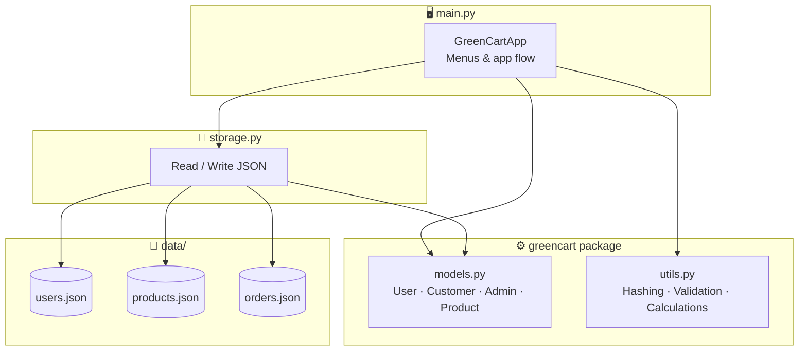
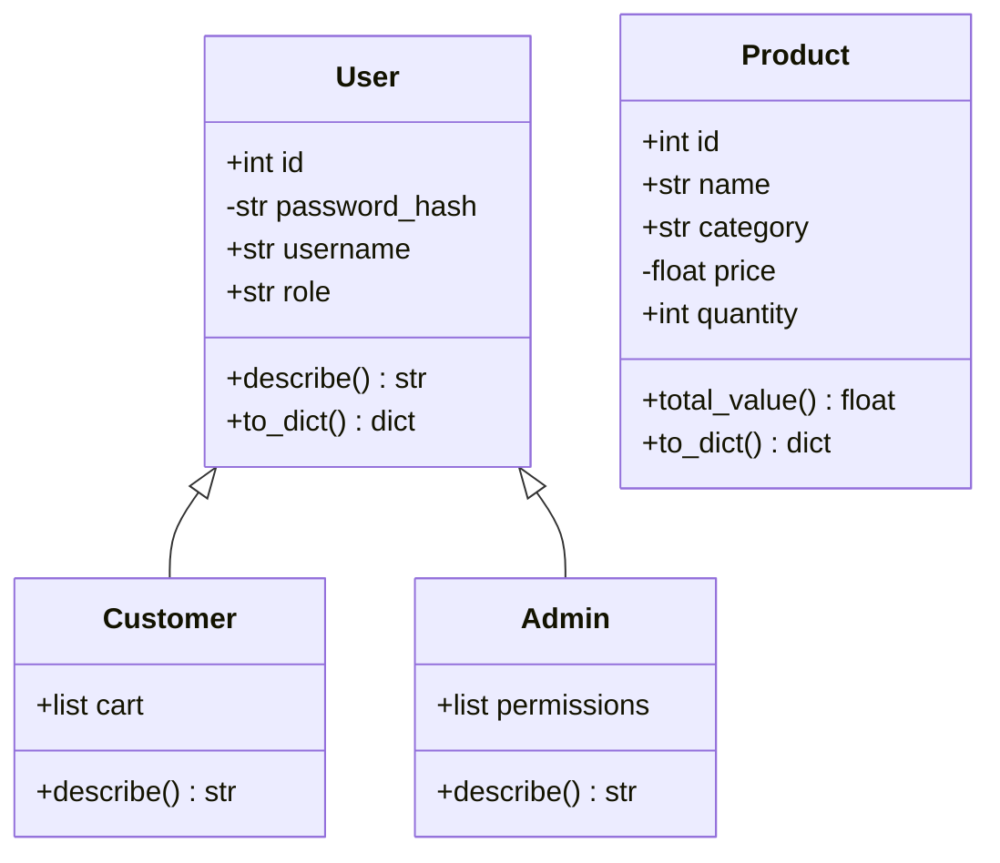
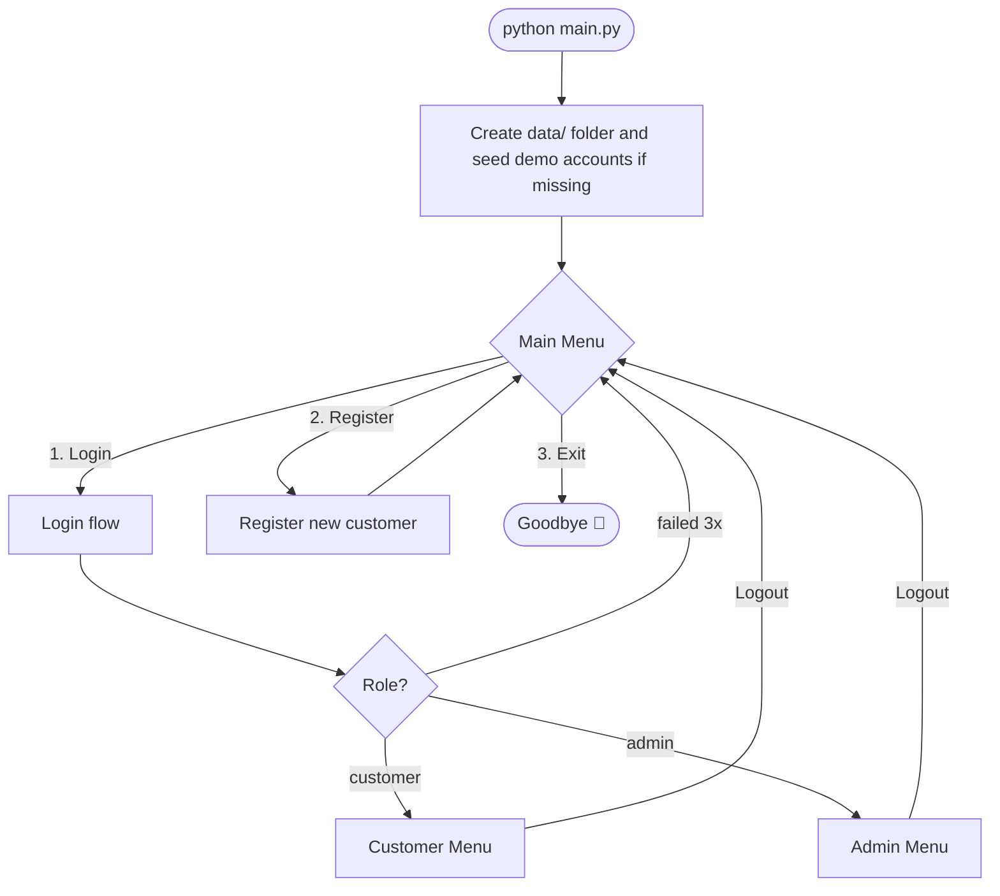
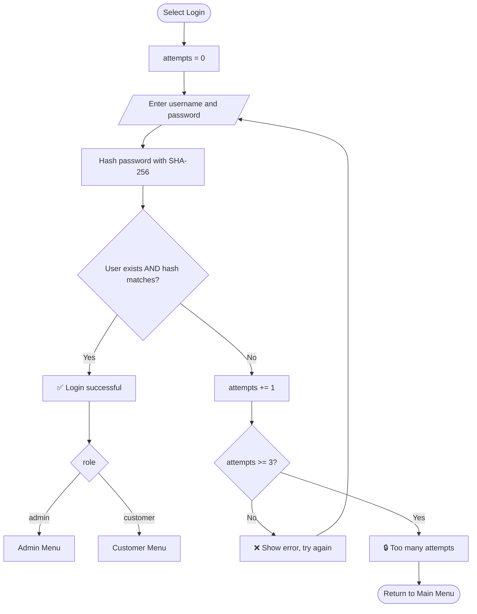
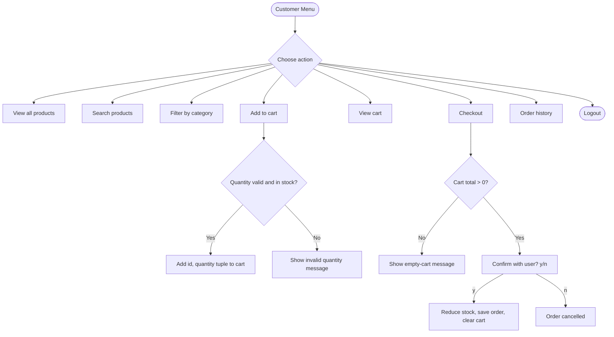
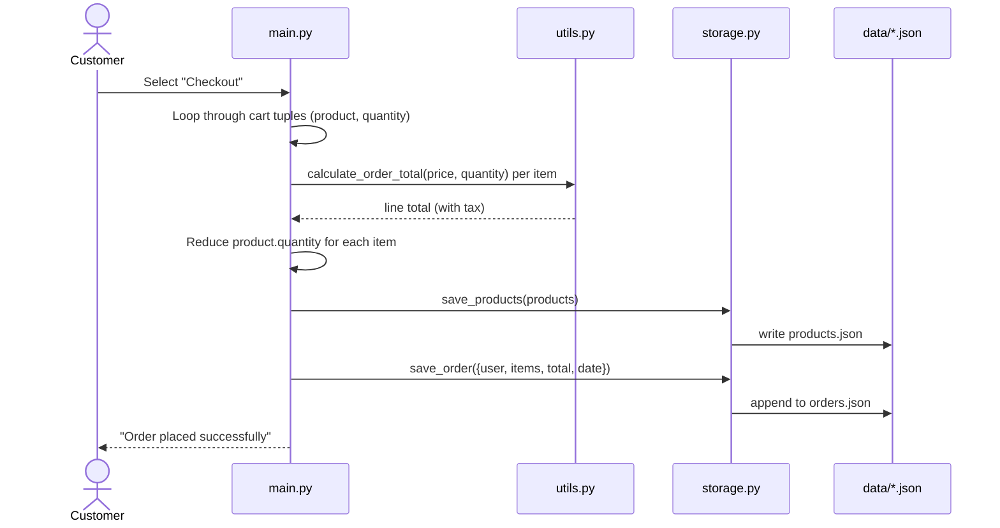
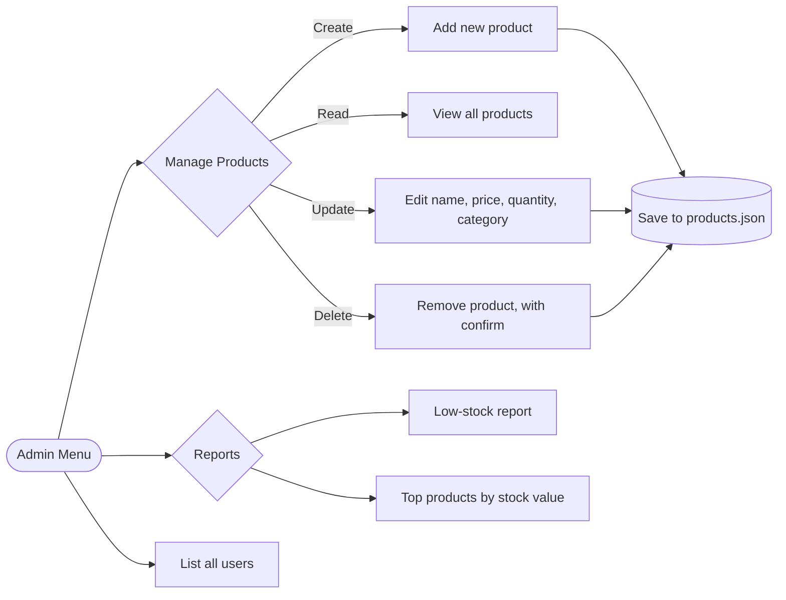
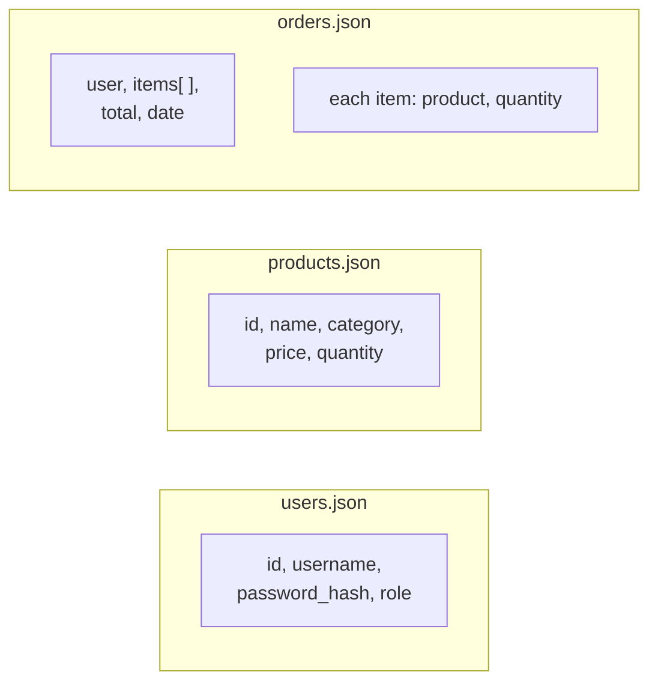

# 🛒 GreenCart — Online Store Login & Product Management (CLI)


A beginner-friendly, command-line Python project built as a college assignment.
It combines a **secure login/registration system** with **full CRUD** product
management for a small online store — all in pure Python, no external
libraries, no database server.

> Built to demonstrate Python fundamentals, OOP, and file-based persistence
> in one realistic, working application.

---

## 📑 Table of Contents

1. [Features](#-features)
2. [Tech Stack](#-tech-stack)
3. [System Architecture](#-system-architecture)
4. [Flow Diagrams](#-flow-diagrams)
5. [Data Model](#-data-model)
6. [Getting Started](#-getting-started)
7. [Usage Walkthrough](#-usage-walkthrough)
8. [Project Structure](#-project-structure)
9. [How Login Works](#-how-login-works)
10. [Python Concepts Covered](#-python-concepts-covered)
11. [Security Notes & Limitations](#-security-notes--limitations)
12. [Testing](#-testing)
13. [Troubleshooting](#-troubleshooting)
14. [Roadmap](#-roadmap--future-enhancements)
15. [Author](#-author)

---

## ✨ Features

**Everyone**
- Register a new account / log in (passwords hashed with SHA-256, never stored in plain text)
- 3 failed login attempts sends you back to the main menu
- Password input hidden while typing (`getpass`)

**Customers**
- Browse, search, and filter products by category
- Add items to a cart, check out, and view order history
- Stock is validated and updated automatically on checkout

**Admins**
- Full CRUD on the product catalog: Create, Read, Update, Delete
- Low-stock report and top-products-by-stock-value report
- View all registered users

---

## 🧰 Tech Stack

| Layer | Choice | Purpose |
|---|---|---|
| Language | Python 3.8+ | Core application logic |
| Interface | CLI (`input()` / `print()`) | Menu-driven user interaction |
| Storage | JSON files in `data/` | Lightweight file-based "database" |
| Security | `hashlib` (SHA-256), `getpass` | Password hashing and hidden input |
| Paradigm | Object-Oriented Programming | `User` → `Customer` / `Admin`, `Product` |
| Time | `datetime` | Order timestamps |
| Persistence | `json`, `os` | File I/O and directory handling |

**Standard-library modules used:** `json`, `os`, `hashlib`, `getpass`, `datetime`

No `pip install` needed — just Python itself.

---

## 🏛️ System Architecture

GreenCart follows a simple **layered structure**, separating menus, business
logic, and data persistence:



### Layer responsibilities

| Layer | Module | Responsibility |
|---|---|---|
| Presentation | `main.py` | Displays menus, reads input, calls model/storage/utils functions |
| Business logic | `models.py` | Defines `User`, `Customer`, `Admin`, `Product` — data + small behaviors |
| Business logic | `utils.py` | Password hashing, safe type conversion, totals, validation, search/filter helpers |
| Data access | `storage.py` | Loads/saves JSON, handles a missing or corrupt file gracefully |

### Class diagram

Menus and login logic live in `main.py`, **not** on these classes — the
diagram below only shows what the classes themselves actually hold.



`describe()` is overridden in each subclass — this is the project's example
of **polymorphism**. `password_hash` and `price` are private attributes
exposed only through `@property` — the project's example of **encapsulation**.

---

## 🔄 Flow Diagrams

### 1. Application flow (main menu → role menus)



### 2. Login & authentication flow



### 3. Customer shopping flow



### 4. Checkout sequence



### 5. Admin CRUD flow



---

## 🗄️ Data Model

GreenCart stores data as flat JSON **lists of records** (not a relational
database) — one file per entity:



### Real record shapes (from `storage.py` / `models.py`)

**`data/users.json`** — a list, keyed by nothing (username is a field):
```json
[
  { "id": 1, "username": "admin", "password_hash": "<sha256-hex>", "role": "admin" },
  { "id": 2, "username": "john",  "password_hash": "<sha256-hex>", "role": "customer" }
]
```

**`data/products.json`**:
```json
[
  { "id": 1, "name": "Wireless Mouse", "price": 799.0, "quantity": 25, "category": "electronics" }
]
```

**`data/orders.json`**:
```json
[
  {
    "user": "john",
    "items": [ { "product": "Wireless Mouse", "quantity": 2 } ],
    "total": 1677.9,
    "date": "2026-09-28 07:47"
  }
]
```

---

## 🚀 Getting Started

### Prerequisites
- Python **3.8 or newer** (check with `python --version`)
- Git (optional, for cloning)

### Installation & run

```bash
git clone https://github.com/<your-username>/greencart-cli.git
cd greencart-cli
python main.py
```

> On some systems use `python3 main.py` instead.

**Demo accounts** (auto-created on first run):

| Role | Username | Password |
|---|---|---|
| Admin | `admin` | `admin123` |
| Customer | `john` | `john123` |

Or register your own account from the main menu.

> ⚠️ These demo credentials are for local testing only. Change or remove them before any real use.

---

## 🎮 Usage Walkthrough

```text
------------------------------------------------------------
  WELCOME TO GREENCART
------------------------------------------------------------
  1. Login
  2. Register
  3. Exit

Choose an option: 2
Username: john
Password: ********
Welcome back, john! Logged in as customer.

------------------------------------------------------------
  CUSTOMER MENU  |  user: john
------------------------------------------------------------
  1. View all products
  2. Search products
  3. Filter by category
  4. Add to cart
  5. View cart
  6. Checkout
  7. My order history
  8. Logout
```

> Replace this sample with a real screenshot or terminal recording of your app.

---

## 📁 Project Structure

```
greencart_cli/
├── main.py               # Entry point — menus and app flow (GreenCartApp)
├── greencart/
│   ├── __init__.py
│   ├── models.py          # OOP: User, Customer, Admin, Product
│   ├── storage.py         # File I/O — reads/writes JSON "database"
│   └── utils.py           # Hashing, calculations, validation, helpers
├── data/                  # Auto-created on first run (ignored by git)
│   ├── users.json
│   ├── products.json
│   └── orders.json
├── statement.md            # Problem statement / project brief
├── .gitignore
└── README.md
```

---

## 🔐 How Login Works

1. You enter a username and password (hidden while typing via `getpass`).
2. `utils.verify_password()` hashes the typed password with **SHA-256** and
   compares it to the stored hash — the real password is never saved anywhere.
3. On success, your `role` (`customer` or `admin`) decides which menu you get.
4. Three wrong attempts in a row sends you back to the main menu.

See the [login flow diagram](#2-login--authentication-flow) above.

---

## 🧠 Python Concepts Covered

| Concept | Where |
|---|---|
| Operators, precedence & associativity | `utils.py` → `calculate_order_total()` |
| Type conversion | `utils.py` → `to_safe_int()`, `to_safe_float()` |
| Data structures (list, dict, tuple, set) | products list, users dict, cart tuples, `unique_categories()` |
| Control flow (`if`/`elif`/`while`/`for`) | login attempt loop, menu loops in `main.py` |
| Functions (default & keyword args) | throughout `utils.py` |
| Modules & packages | `greencart/` package; `json`, `os`, `hashlib`, `getpass`, `datetime` |
| OOP (inheritance, encapsulation, polymorphism) | `models.py` → `User` → `Customer` / `Admin` |
| File I/O & exception handling | `storage.py` |
| CRUD | Admin menu in `main.py` |

---

## 🛡️ Security Notes & Limitations

This is a **learning project**, not production software. Known limitations:

| Area | Current state | Better practice |
|---|---|---|
| Password hashing | Plain SHA-256 (fast, unsalted) | Use a salted, slow KDF such as `hashlib.pbkdf2_hmac`, `bcrypt`, or `argon2` |
| Storage | Unencrypted JSON files | Use a real database with access control |
| Lockout | Resets whenever you return to the main menu | Persist attempts and add a timed lockout |
| Concurrency | No file locking; not safe for multiple users at once | Use a database or file locks |
| Demo accounts | Hard-coded credentials | Remove or force a password change on first login |

Good things already in place: no plain-text passwords, hidden password input,
input validation, and role-based menu access.

---

## 🧪 Testing

There's no automated test suite yet — testing is manual. Suggested checklist:

- [ ] Register a new user, then log in with it
- [ ] Log in with a wrong password 3 times → returned to main menu
- [ ] Register with an existing username → rejected
- [ ] Customer: try to add more of an item than is in stock → rejected
- [ ] Customer: checkout reduces stock and creates an order
- [ ] Admin: create, update, and delete a product
- [ ] Admin: low-stock report shows the expected items
- [ ] Enter letters where a number is expected → no crash
- [ ] Delete the `data/` folder and restart → demo data is recreated

Adding automated tests with Python's built-in `unittest` module is listed
under [Roadmap](#-roadmap--future-enhancements).

---

## 🩺 Troubleshooting

| Problem | Fix |
|---|---|
| `python: command not found` | Use `python3`, or install Python from [python.org](https://www.python.org/downloads/) |
| `ModuleNotFoundError: No module named 'greencart'` | Run `python main.py` from the project's root folder, not from inside `greencart/` |
| Password not visible while typing | Expected — `getpass` hides input. In some IDE consoles it may not work, so use a real terminal |
| App crashes or data looks corrupted on start | Delete the `data/` folder; it is recreated with demo data on the next run |
| Forgot the admin password | Delete `data/users.json` to reset to the demo accounts |

---

## 🗺️ Roadmap / Future Enhancements

- [ ] Delivery scheduler using `datetime`
- [ ] Swap JSON storage for SQLite
- [ ] Discount coupons
- [ ] Change-password option
- [ ] Salted password hashing (PBKDF2 / bcrypt)
- [ ] Automated unit tests with `unittest`
- [ ] Export orders to CSV

---

## 👤 Author

**[Your Name]** — [your.email@example.com]
Built as a college Python project, [Month Year].


